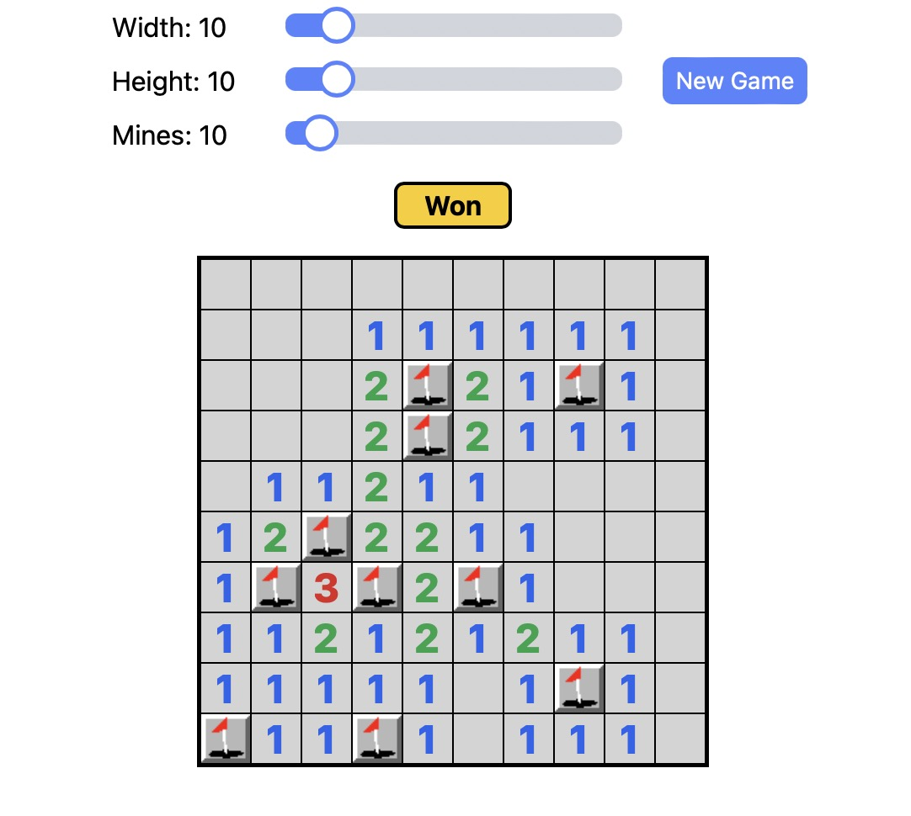
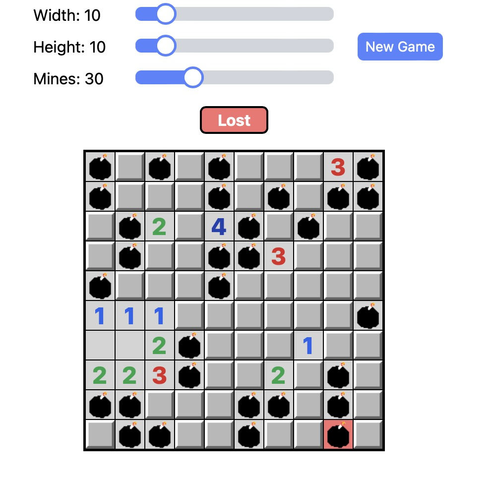
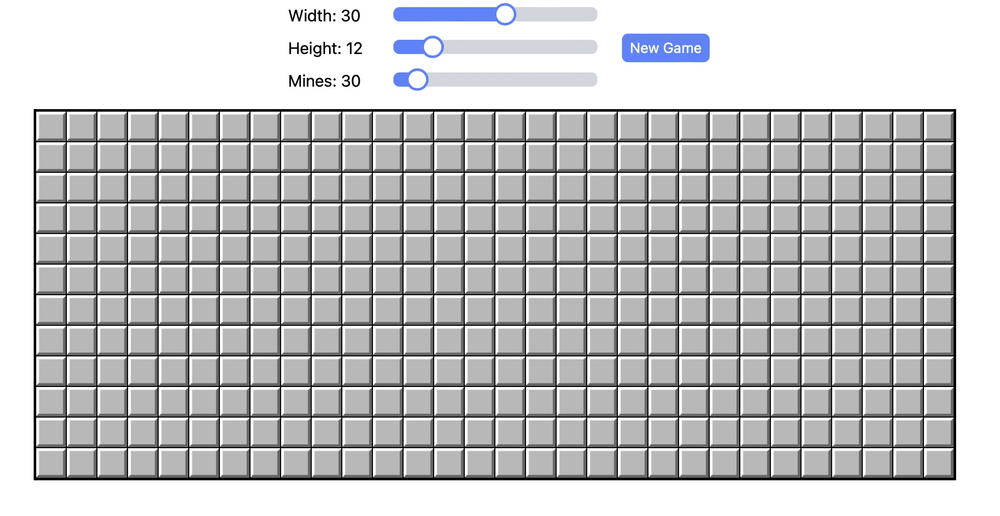

<h1>Minesweeper Clone, a Web Application</h1>

This is a web application where you can play Minesweeper.

Tech stack: React, Typescript, Tailwind CSS

Features:

<ol>
   <li>Contains all basic Minesweeper functionality, such as the win and loss conditions as well as acceptable user actions.</li>
   <li>Can change board size up to a 50x50 board.</li>
   <li>Can change mine amount up to one less than the number of board tiles.</li>
</ol>

<h2>Demo</h2>

Click here to view a demo of the website.

https://github.com/inadeauu/minesweeper/assets/123025115/3cf37a3b-113e-4d12-9ec3-343befd4e11f

<h2>Local Install Instructions</h2>

To locally install and run this project on your machine:

<ol>
   <li>Clone this Github repository</li>
   <li>Within the minesweeper folder, run "npm i"</li>
   <li>Within the minesweeper folder, run "npm run dev"</li>
   <li>Navigate to localhost:5173 in a web browser</li>
</ol>

<h2>Images</h2>
<h3>Minesweeper Win</h3>

<h3>Minesweeper Loss</h3>

<h3>Minesweeper Board</h3>

